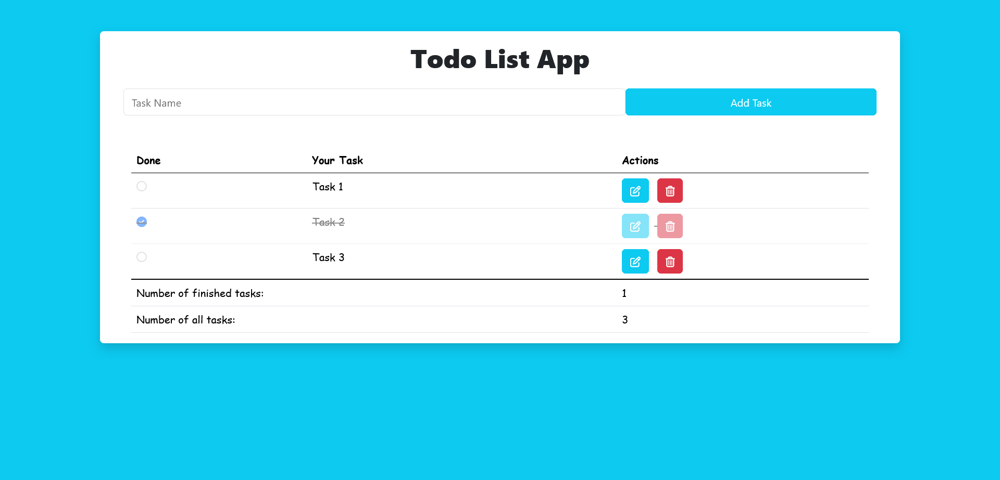

# Todo List App

This is a simple Todo List application built using HTML, CSS, and JavaScript. The application allows users to add tasks, mark them as done, and keep track of the number of finished and total tasks.

## Table of Contents

- [Design](#design)
- [Project Structure](#project-structure)
- [Features](#features)
- [How to Use](#how-to-use)
- [Scripts](#scripts)
- [Dependencies](#dependencies)
- [Links](#links)
- [License](#license)
- [Author](#author)

## Design

## Project Structure

The project consists of the following files:

| File/Directory               | Description                                                              |
|------------------------------|--------------------------------------------------------------------------|
| `index.html`                 | The main HTML file that contains the structure of the Todo List app.      |
| `css/style.css`              | The CSS file that styles the application interface.                       |
| `css/bootstrap.min.css`      | A CSS file for Bootstrap, used to provide responsive design elements.     |
| `css/all.min.css`            | A CSS file for Font Awesome, providing icons used in the application.     |
| `js/main.js`                 | The JavaScript file that handles the application's functionality.         |

## Features

- **Add Tasks**: Users can add new tasks by entering a task name and clicking the "Add Task" button.
- **Mark Tasks as Done**: Users can mark tasks as done, which updates the task count.
- **Task Count**: The application displays the number of finished tasks and the total number of tasks.
- **Responsive Design**: The interface adjusts to different screen sizes using Bootstrap.

## How to Use

1. Open `index.html` in your web browser.
2. Enter a task name in the input field.
3. Click the "Add Task" button to add the task to the list.
4. Mark tasks as done by checking the corresponding checkbox.
5. The number of finished tasks and total tasks will be automatically updated.

## Scripts

- `main.js`: This script manages the todo list functionality, including adding tasks, marking tasks as done, and updating task counts.

## Dependencies

- **Bootstrap**: Bootstrap is used for the responsive layout and button styling.
- **Font Awesome**: Font Awesome is used for icons within the application.

## Links 

- **Repo**: [Github Repo](https://github.com/basemsameh/Todo-List-App.git)
- **Demo**: [Live URL](https://basemsameh.github.io/Todo-List-App/)

## License

This project is open-source and available under the MIT License.

## Author

- **Name**: [Basem](Basem)
- **GitHub**: [GitHub Profile](https://github.com/basemsameh)
- **Linkedin**: [Linkedin](https://www.linkedin.com/in/basem-sameh-671b5b212/)